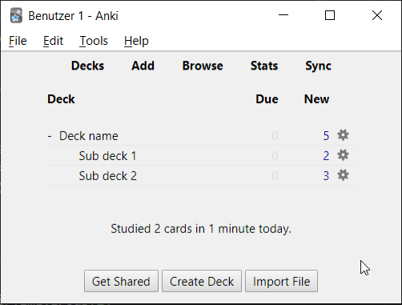

# md2anki

Convert markdown documents to anki flashcards with this simple python script. 

Powered by [python-markdown2](https://github.com/trentm/python-markdown2) and [genanki](https://github.com/kerrickstaley/genanki).

## Features

- Include images
- Markdown image size specifiers
- Tables
- All the basic markdown syntax

## Usage

```
python md2anki.py .\example\example.md
```

Other:

```
usage: md2anki.py [-h] [-o OUTPUT] [-s STYLE] INPUT

Convert markdown to anki deck.

positional arguments:
  INPUT                 Input *.md path.

optional arguments:
  -h, --help            show this help message and exit
  -o OUTPUT, --output OUTPUT
                        Output *.apkg path.
  -s STYLE, --style STYLE
                        CSS card style path.
```

## Dependencies

`md2anki` depends on `markdown2` and `genanki`.

```
pip install genanki
pip install markdown2
```

## Example

Turn this:

```markdown
# Deck name

## Sub deck 1

### A card question?

An answer!

### Another card question?

Another answer... _With an image!_


## Sub deck 2

### Can you use tables?

- Yes!

| This is | a  | table    |
|---------|----|----------|
| This    | is | great!   |
| This    | is | amazing! |
| This    | is | ok!      |
```

Into this:

